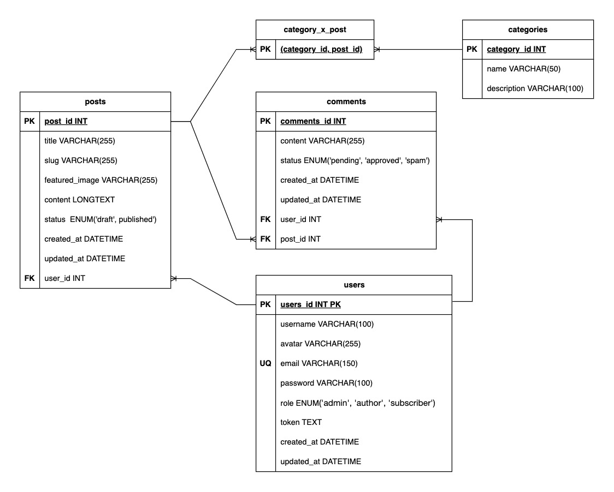

# Science Blog


This project has been developed with PHP and MySQL. It's a blog where there are admin, authors and subscribers role. Everyone can do certain actions depending on the role. I used the ***OOP (object-oriented programming)*** and ***the MVC (Movel View Controller) architetural pattern.***

#### The database design: 
The database design has the various relationships that exist between the tables in the database:



## Features:
- Science articles organized by categories
- User authentication with 3 roles
- Article commenting system
- Content management for authors and admins

### User Roles:
| Role         | Permissions                              |
|--------------|------------------------------------------|
| **Admin**    | Full system management                   |
| **Author**   | Create/edit articles and comment         |
| **Subscriber**| Read articles and comment               |

### Key Functionality:
- User registration/login system
- CRUD operations for science articles
- Category-based organization
- Commenting system
- Category filtering

### Relationships:
- Users 1→N Posts
- Users 1→N Comments
- Posts 1→N Comments
- Posts M↔N Categories (via categories_has_posts)

## Installation:

#### 1. Clone the repo

First, clone this repository to your local machine using the following command in your terminal:

```bash
git clone https://github.com/NeilChavez/php-blog
```


#### 2. Import Database Structure
- Log in to PHPMyAdmin. 
- Create a new database named 'blog-php' (if it doesn't exist).
- Select the database.
- Navigate to Import > Select File
- Select dump.sql and set format to SQL

```
php-blog
|__ ...
|__ dump.sql
|__ ...
```

Create a file .env at the root level of the project and update to your configuration:

```env
BD_HOST="your localhost"
DB_USER="your root"
DB_PASS="your password"
DB_NAME="your databse name"
```

#### 3. Run the project
Use a local web server or the built-in PHP development server to run the application. Below is an example using the built-in PHP server:
```
cd public
php -S localhost:3000
```
You can now access the application in your web browser by navigating to the URL http://localhost:3000.

